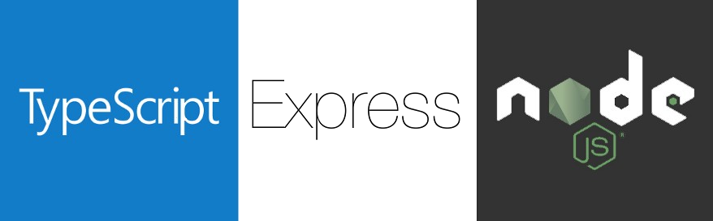

<h2 align="center">
  Template para projetos NodeJS + TypeScript
</h2>

## 🚀 Sobre

Este template é pré-configurado para iniciar um projeto NodeJS + TypeScript. Já possui configurações de Eslint e Prettier, que podem ser modificadas de acordo com as necessidades e/ou preferências. A ORM utilizada é o TypeORM, já possui um arquivo de configuração inicial e precisa apenas trocar as informações de acesso ao Banco de Dados. Para upload de arquivos foi utilizado a biblioteca Multer.

---

## 💻 Tecnologias

- NodeJS
- Express
- TypeScript
- TypeORM
- Postgres
- Eslint
- Prettier
- Multer

---

## 🧾 Instruções

- ### Comandos importantes

  - Criar migrations -> `yarn typeorm migration:create -n MigrationName`

  - Executar migrations -> `yarn typeorm migration:run`

  - Reverter migrations -> `yarn typeorm migrations:revert`

  - Mostrar migrations -> `yarn typeorm migration:show`

- ### Erros

  - Como a class AppError já está configurada, para o tratamento de Exceptions basta importar a classe e usar este código:

    `throw new AppError('Mensagem de erro', statusCode);`

---

## 🚀 Instalação e execução

1. Faça um clone ou crie um novo repositório a partir deste template;
2. Entre na pasta do projeto pelo terminal;
3. Rode `yarn` para instalar as dependências;
4. Rode `yarn dev:server` para iniciar o servidor de desenvolvimento;
